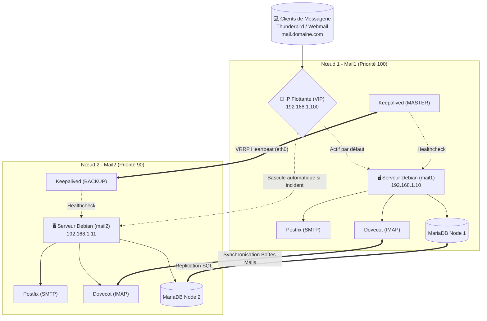

# 📬 Solution de Messagerie Redondante pour la Résilience Opérationnelle
> **Avant-Mémoire de Fin d'Études en vue de l'obtention du Diplôme de Master en Informatique**  
> **Mention :** Informatique  
> **Domaine :** Sciences de la Technologie de l'Information et de la Communication  
> **Présenté par :** RATOVOARISOA Mendrika Manjaka Ricardo  
> **Directeur de mémoire :** M. RASOLOMANANA Jean Fanomezantsoa  
> **Encadreur professionnel :** M. RAHARIJAONA Andry  
> **Institution :** Institut Supérieur Spécialisé en Informatique et en Gestion – La Salle Infocentre (Soavimbahoaka, Antananarivo)  
> **Entreprise d'accueil :** Caisse d'Épargne de Madagascar (Siège Tsaralalàna, Antananarivo)  
> **Année universitaire :** 2023-2024  

---

---

## 📑 Sommaire
1. [Contexte Institutionnel & Entreprise d'Accueil](#1-contexte-institutionnel--entreprise-daccueil)
2. [Objectifs & Problématique](#2-objectifs--problématique)
3. [Architecture & Méthodologie](#3-architecture--méthodologie)
4. [Outils & Technologies](#4-outils--technologies)
5. [Démonstration du Basculement (Failover)](#5-démonstration-du-basculement-failover)
6. [Limites & Discussion](#6-limites--discussion)
7. [Perspectives d'Avenir (PCA & Monitoring)](#7-perspectives-davenir-pca--monitoring)
8. [Guide de Déploiement](#8-guide-de-déploiement)

---

## 1. Contexte Institutionnel & Entreprise d'Accueil

### 🏢 Caisse d'Épargne de Madagascar (CEM)
* **Création :** 1918 (Société Anonyme confirmée en 2001).
* **Localisation :** 21, Rue Karija – Tsaralalàna, Antananarivo.
* **Direction d'accueil :** Direction du Système d'Information (DSI).

Le projet s'inscrit au sein du **Service Systèmes, Réseaux et Maintenance**, en étroite collaboration avec le **Service de la Sécurité Informatique et de la Télécommunication**.

---

## 2. Objectifs & Problématique

La messagerie électronique constitue un canal critique pour les échanges inter-agences, les opérations financières et les communications institutionnelles de la Caisse d'Épargne de Madagascar.

* **Problématique :** Comment garantir une continuité de service sans interruption (Haute Disponibilité) en cas de défaillance matérielle ou logicielle du serveur de messagerie principal ?
* **RTO (Recovery Time Objective) :** Réduction du temps d'interruption à moins de **2 secondes**.
* **RPO (Recovery Point Objective) :** Zéro perte de courriels grâce à la synchronisation continue.

---

## 3. Architecture & Méthodologie

L'approche repose sur trois piliers fondamentaux :
1. **Réplication des données :** Synchronisation de la base MariaDB (utilisateurs, domaines, quotas) en mode maître-esclave / dual-master.
2. **Synchronisation du stockage e-mails :** Réplication des boîtes aux lettres (`Maildir`) via Dovecot dsync / Rsync.
3. **Bascule automatique :** Attribution d'une adresse IP virtuelle flottante (VIP) gérée par Keepalived (protocole VRRP).

---

## 4. Outils & Technologies

| Catégorie | Outil / Logiciel | Rôle dans l'infrastructure |
| :--- | :--- | :--- |
| **Système** |  | Système d'exploitation stable, robuste et sécurisé. |
| **Panneau de contrôle** | **ISPConfig** | Gestion centralisée de la messagerie, des domaines et des comptes. |
| **Haute Disponibilité** | **Keepalived** | Gestion de l'IP virtuelle et basculement automatique via VRRP. |
| **Synchronisation** | **Rsync / Dovecot dsync** | Transfert et synchronisation continue des données de messagerie. |
| **Base de Données** | **MariaDB** | Stockage des utilisateurs virtuels, mots de passe chiffrés et quotas. |
| **MTA & MDA** | **Postfix & Dovecot** | Routage SMTP sécurisé et consultation IMAP/POP3. |

---

## 5. Démonstration du Basculement (Failover)

### Scénario de test :
1. **État initial :** L'adresse IP virtuelle `192.168.1.100` est active sur `mail1`.
2. **Simulation d'incident :** Coupure inopinée du service Postfix sur `mail1` (`systemctl stop postfix`).
3. **Détection Keepalived :** Le script de santé échoue, la priorité de `mail1` décroît.
4. **Prise de relais immédiate :** `mail2` détecte la défaillance et élève son interface en `MASTER`.
5. **Résultat client :** Le client Mozilla Thunderbird continue d'émettre et recevoir ses e-mails de manière totalement transparente.

---

## 6. Limites & Discussion

Bien que la solution réponde aux exigences de haute disponibilité locale, plusieurs points de vigilance doivent être intégrés :
* **Nécessité de sauvegarde hors site :** La réplication locale ne remplace pas une politique de backup externalisée (ex: règle 3-2-1).
* **Validation des tests de basculement :** Obligation d'audits et de tests de défaillance périodiques pour vérifier l'intégrité des scripts.
* **Importance des tests fréquents :** Garantir que les index Dovecot et les réplications MariaDB ne subissent aucune dérive.
* **Plan de maintenance préventive :** Mise à jour coordonnée des paquets Debian sans rupture de service.

---

## 7. Perspectives d'Avenir (PCA & Monitoring)

Pour faire évoluer la résilience du système d'information de la Caisse d'Épargne :
1. **Virtualisation et Cloud Hybride :** Déploiement de nœuds de secours sur une infrastructure distante ou cloud privé.
2. **Systèmes de Monitoring Avancé :** Intégration d'un tableau de bord (Prometheus + Grafana / Zabbix) avec alertes SMS/e-mail en temps réel.
3. **Plan de Continuité des Activités (PCA) :** Intégration globale de la messagerie dans la stratégie globale de PCA/PRA de la banque.
4. **Formation continue des employés :** Sensibilisation et formation continue des équipes d'exploitation du Service Systèmes & Réseaux.

---

## 8. Guide de Déploiement

### Structure des dossiers du dépôt
* `configs/` : Fichiers de configuration nettoyés (Keepalived, Postfix, Dovecot, MariaDB).
* `scripts/` : Scripts de surveillance (`check_mail_health.sh`) et de synchronisation.
* `docs/images/` : Visuels et diapositives du mémoire illustrant le projet.
* `tests/` : Protocoles détaillés des tests de basculement.
