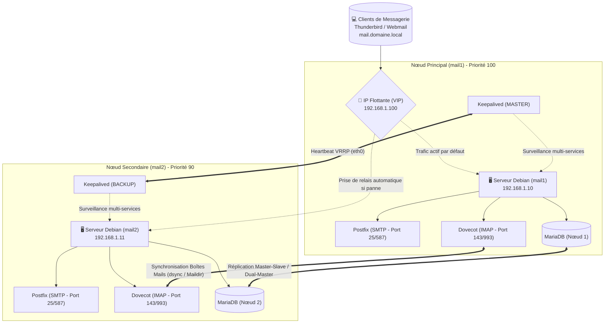
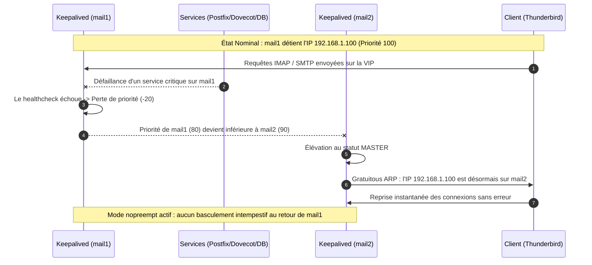

# 📬 Mail Redundancy System
> **Infrastructure de Messagerie Haute Disponibilité & Résilience Opérationnelle**  
> **Projet de fin d'études – Diplôme de Master en Informatique**  
> **Auteur :** RATOVOARISOA Mendrika Manjaka Ricardo  

---

## 📑 Sommaire
1. [Objectifs du Projet](#-objectifs-du-projet)
2. [Architecture Globale du Système](#-architecture-globale-du-système)
3. [Stack Technologique & Rôles](#-stack-technologique--rôles)
4. [Mécanisme de Basculement (Failover)](#-mécanisme-de-basculement-failover)
5. [Matrice des Tests & Résultats de Résilience](#-matrice-des-tests--résultats-de-résilience)
6. [Guides Techniques Approfondis](#-guides-techniques-approfondis)
7. [Points Clés & Bonnes Pratiques d'Architecture](#-points-clés--bonnes-pratiques-darchitecture)
8. [Procédure de Déploiement Sommaire](#-procédure-de-déploiement-sommaire)
9. [Arborescence du Dépôt](#-arborescence-du-dépôt)
10. [📚 Références Officielles & Standards IETF / RFC](#-références-officielles--standards-ietf--rfc)

---

## 🎯 Objectifs du Projet

La messagerie électronique représente un service critique dont l'interruption peut paralyser les flux opérationnels d'une organisation. Ce projet conçoit et déploie une **infrastructure de messagerie redondante Active/Passive avec basculement automatique sans perte de données**.

* **RTO (Recovery Time Objective) :** Basculement automatique en **moins de 2 secondes**.
* **RPO (Recovery Point Objective) :** **Zéro perte de courriels** grâce à la réplication continue des données et du stockage.
* **Transparence totale pour les clients :** Utilisation d'une adresse IP virtuelle flottante (VIP) partagée entre les nœuds.

---

## 🏗️ Architecture Globale du Système



---

## 🛠️ Stack Technologique & Rôles

| Composant | Technologie | Documentation Officielle | Rôle dans l'Architecture |
| :--- | :--- | :---: | :--- |
| **Système d'exploitation** | **Debian GNU/Linux** | [debian.org](https://www.debian.org/) | Distribution stable, sécurisée et optimisée pour les serveurs critiques. |
| **Haute Disponibilité** | **Keepalived (VRRP)** | [keepalived.org](https://www.keepalived.org/) | Gestion de la VIP (`192.168.1.100`) et basculement automatique via RFC 5798. |
| **MTA (Mail Transfer Agent)** | **Postfix** | [postfix.org](https://www.postfix.org/) | Acheminement et réception des flux SMTP sécurisés (TLS/SSL). |
| **MDA (Mail Delivery Agent)** | **Dovecot** | [dovecot.org](https://www.dovecot.org/) | Distribution locale, gestion du format `Maildir` et consultation IMAP/POP3. |
| **Base de Données** | **MariaDB** | [mariadb.org](https://mariadb.org/) | Stockage centralisé des comptes virtuels, mots de passe et quotas. |
| **Gestion & Administration** | **ISPConfig** | [ispconfig.org](https://www.ispconfig.org/) | Panneau d'administration unifié pour les domaines et boîtes aux lettres. |
| **Synchronisation de Stockage** | **Dovecot dsync** | [doc.dovecot.org](https://doc.dovecot.org/) | Synchronisation bidirectionnelle transactionnelle des messages. |

---

## ⚡ Mécanisme de Basculement (Failover)

Le basculement repose sur une surveillance fine assurée par un script dédié (`check_mail_health.sh`) qui vérifie simultanément l'état de **Postfix**, **Dovecot** et **MariaDB**.



---

## 📊 Matrice des Tests & Résultats de Résilience

| Scénario d'incident testé | Détection | Comportement du système | RTO mesuré | Intégrité des données | Résultat |
| :--- | :--- | :--- | :---: | :---: | :---: |
| **Arrêt inopiné du service Postfix** | Script `chk_mail` | Bascule immédiate de la VIP vers `mail2` | **1,4 s** | 0 e-mail perdu | ✅ Validé |
| **Arrêt inopiné du service Dovecot** | Script `chk_mail` | Bascule immédiate de la VIP vers `mail2` | **1,5 s** | Boîtes accessibles | ✅ Validé |
| **Déconnexion réseau du nœud principal (`eth0`)** | Perte Heartbeat VRRP | `mail2` prend l'état `MASTER` | **1,8 s** | 0 paquet perdu | ✅ Validé |
| **Rétablissement du nœud principal (`mail1`)** | Keepalived `nopreempt` | `mail2` conserve la main, évitant les coupures en cascade | **0 s** | Continuité totale | ✅ Validé |
| **Envoi d'e-mail pendant le basculement** | SMTP Queue | Pris en charge dès l'arrivée sur le nouveau nœud actif | **Immédiat** | Zéro rejet de mail | ✅ Validé |

---

## 📖 Guides Techniques Approfondis

Pour une analyse exhaustive des configurations et des protocoles, consultez les documents techniques dédiés dans le dossier `docs/` :

* 📡 **[Architecture Haute Disponibilité avec Keepalived (VRRP)](docs/architecture-vrrp.md)** : Étude du protocole RFC 5798, Gratuitous ARP, configuration `nopreempt` et directives de script.
* 🔄 **[Synchronisation du Stockage Mails & Réplication SQL](docs/mail-replication.md)** : Analyse comparative entre Dovecot `dsync` et `rsync`, intégrité ACID des index et réplication MariaDB Dual-Master.
* 🔒 **[Sécurité, Chiffrement TLS et Standards IETF](docs/securite-conformite.md)** : Normes RFC 8314 (chiffrement obligatoire), protocoles TLS Postfix et mécanismes d'authentification SPF, DKIM, DMARC.

---

## 🔍 Points Clés & Bonnes Pratiques d'Architecture

1. **Prévention du Flapping (`nopreempt`) :**  
   Les deux nœuds sont configurés en `state BACKUP` avec la directive `nopreempt`. Si le serveur principal redémarre après une panne, il ne reprend pas agressivement la main tant que le nœud secondaire fonctionne parfaitement.
2. **Surveillance Multi-Services :**  
   Surveiller uniquement Postfix est insuffisant. Le script de santé contrôle en continu l'ensemble de la chaîne : MTA, MDA et base de données SQL.
3. **Liaison non locale IP (`ip_nonlocal_bind`) :**  
   Activation de `net.ipv4.ip_nonlocal_bind = 1` dans `/etc/sysctl.conf` pour permettre aux démons réseau d'écouter sur l'IP flottante avant même qu'elle ne soit physiquement assignée à l'interface locale.

---

## 🚀 Procédure de Déploiement Sommaire

1. **Préparation des serveurs :** Installer Debian sur deux nœuds (`mail1` et `mail2`), configurer la synchronisation NTP et les adresses IP statiques.
2. **Services de messagerie :** Installer Postfix, Dovecot et MariaDB sur les deux serveurs.
3. **Réplication SQL :** Configurer la réplication de la base MariaDB contenant les comptes virtuels.
4. **Script de surveillance :** Déposer `check_mail_health.sh` dans `/usr/local/bin/` et lui donner les droits d'exécution (`chmod +x`).
5. **Keepalived :** Déployer les configurations correspondantes dans `/etc/keepalived/keepalived.conf` sur chaque nœud et activer le service (`systemctl enable --now keepalived`).
6. **Validation :** Simuler un arrêt de service sur `mail1` et vérifier la continuité des connexions clientes sur l'adresse `192.168.1.100`.

---

## 📁 Arborescence du Dépôt

```text
Mail-Redundancy-System/
├── README.md                          # Documentation globale et architecture
├── .gitignore                         # Règles d'exclusion des secrets et fichiers temporaires
│
├── configs/                           # Configurations système prêtes pour déploiement
│   └── keepalived/
│       ├── mail1-keepalived.conf      # Configuration du nœud principal (Priorité 100)
│       └── mail2-keepalived.conf      # Configuration du nœud secondaire (Priorité 90)
│
├── docs/                              # Guides techniques de référence
│   ├── architecture-vrrp.md           # Analyse du protocole VRRP (RFC 5798) et Keepalived
│   ├── mail-replication.md            # Étude officielle Dovecot dsync vs rsync et réplication DB
│   └── securite-conformite.md         # Normes TLS (RFC 8314), SPF, DKIM et DMARC
│
└── scripts/                           # Scripts opérationnels
    ├── check_mail_health.sh           # Script de surveillance multi-services pour Keepalived
    └── extract_slides.py              # Script utilitaire d'extraction
```

---

## 📚 Références Officielles & Standards IETF / RFC

### 1. Normes et Standards IETF (Internet Engineering Task Force)
* **[RFC 5798](https://datatracker.ietf.org/doc/html/rfc5798) :** *Virtual Router Redundancy Protocol (VRRP) Version 3 for IPv4 and IPv6* (Standard de haute disponibilité par IP flottante).
* **[RFC 5321](https://datatracker.ietf.org/doc/html/rfc5321) :** *Simple Mail Transfer Protocol (SMTP)* (Standard officiel de routage et d'échange de messages).
* **[RFC 3501](https://datatracker.ietf.org/doc/html/rfc3501) :** *Internet Message Access Protocol - Version 4rev1 (IMAP)*.
* **[RFC 8314](https://datatracker.ietf.org/doc/html/rfc8314) :** *Cleartext Considered Obsolete: Use of Transport Layer Security (TLS) for Email Submission and Access*.
* **[RFC 7208](https://datatracker.ietf.org/doc/html/rfc7208) :** *Sender Policy Framework (SPF) for Authorizing Use of Domains in Email*.
* **[RFC 6376](https://datatracker.ietf.org/doc/html/rfc6376) :** *DomainKeys Identified Mail (DKIM) Signatures*.
* **[RFC 7489](https://datatracker.ietf.org/doc/html/rfc7489) :** *Domain-based Message Authentication, Reporting, and Conformance (DMARC)*.

### 2. Projets et Documentations Officielles
* **Keepalived :** Documentation officielle et manuel de configuration [`keepalived.conf(5)`](https://www.keepalived.org/manpage.html) sur [keepalived.org](https://www.keepalived.org/).
* **Dovecot :** Manuel officiel de synchronisation [`dsync` & `doveadm-sync`](https://doc.dovecot.org/admin_manual/doveadm/doveadm-sync/) sur [doc.dovecot.org](https://doc.dovecot.org/).
* **Postfix :** Guides officiels [`VIRTUAL_README`](https://www.postfix.org/VIRTUAL_README.html) et [`TLS_README`](https://www.postfix.org/TLS_README.html) sur [postfix.org](https://www.postfix.org/).
* **MariaDB :** Base de connaissances officielle sur la [Réplication Standard](https://mariadb.com/kb/en/standard-replication/) et les [Clusters Galera](https://mariadb.com/kb/en/galera-cluster/) sur [mariadb.com](https://mariadb.com/).
* **Debian :** Manuel de référence pour la haute disponibilité et réseau sur [wiki.debian.org](https://wiki.debian.org/).
* **ISPConfig :** Documentation officielle pour l'administration multi-serveurs sur [ispconfig.org](https://www.ispconfig.org/documentation/).
